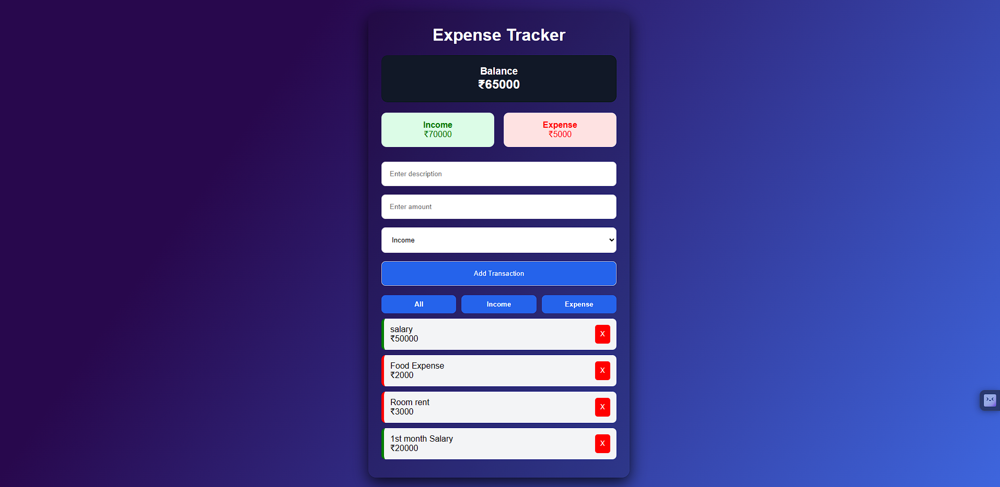
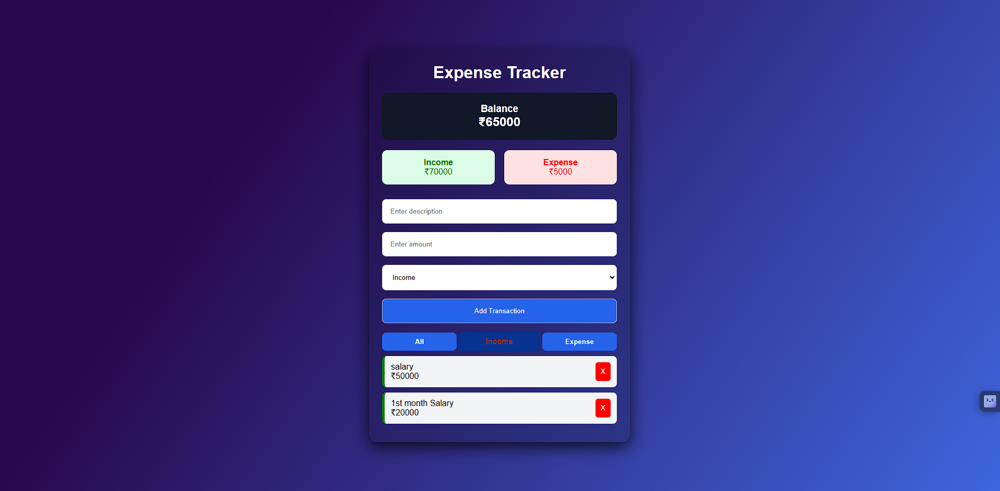
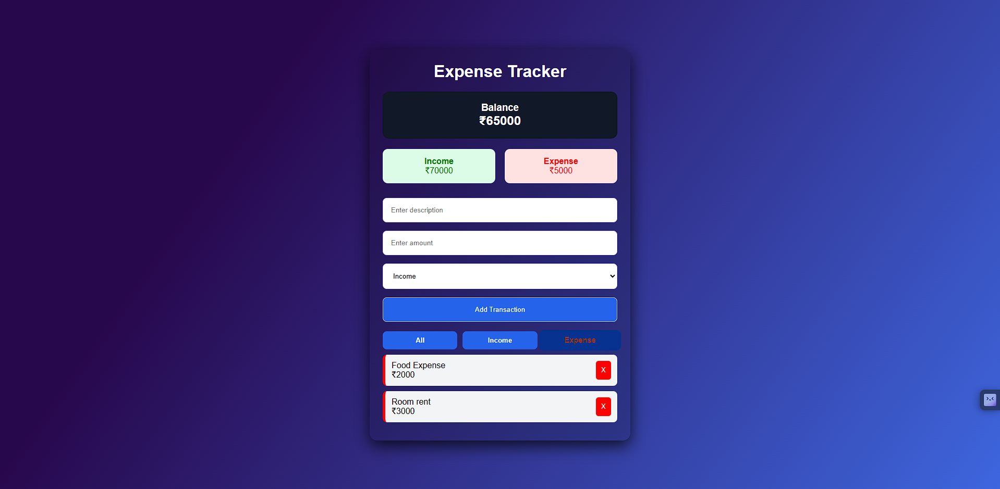

# Expense Tracker

A user-friendly and dynamic **Expense Tracker Web Application** built using **HTML, CSS, and JavaScript**.  
This project helps users manage their income and expenses with a clean interface and real-time calculations.

## Features

- Add income and expense transactions
- Dynamic balance calculation
- Display total income and expenses
- Delete transactions
- Filter transactions by:
  - All
  - Income
  - Expense
- LocalStorage support
- Data remains saved after page refresh
- Responsive modern UI
---
## Technologies Used

- HTML5
- CSS3
- JavaScript (ES6)
- LocalStorage API
---
## Screenshot




---
## Live Demo
live link : https://abhijith-e0.github.io/Expense-tracker/
---
## Project Structure
```bash
Expense tracker/
├── images/
│   ├── Screenshot1.png
│   └── Screenshot2.png
├── index.html
├── style.css
├── script.js
└── README.md
```

